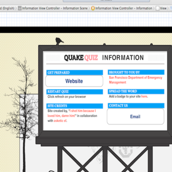

<h2>The Apps</h2>

<section class="aflex">
  

  

  

  

  

  

</section>


<!-- <section class="grid"  data-masonry='{ "itemSelector": ".grid-item", "columnWidth": 200, "gutter": 10, "transitionDuration":"0.5s", "stagger":50 }'>
  
  
  
  
  
  
</section> -->
<!-- 
 -->
<!--  -->
